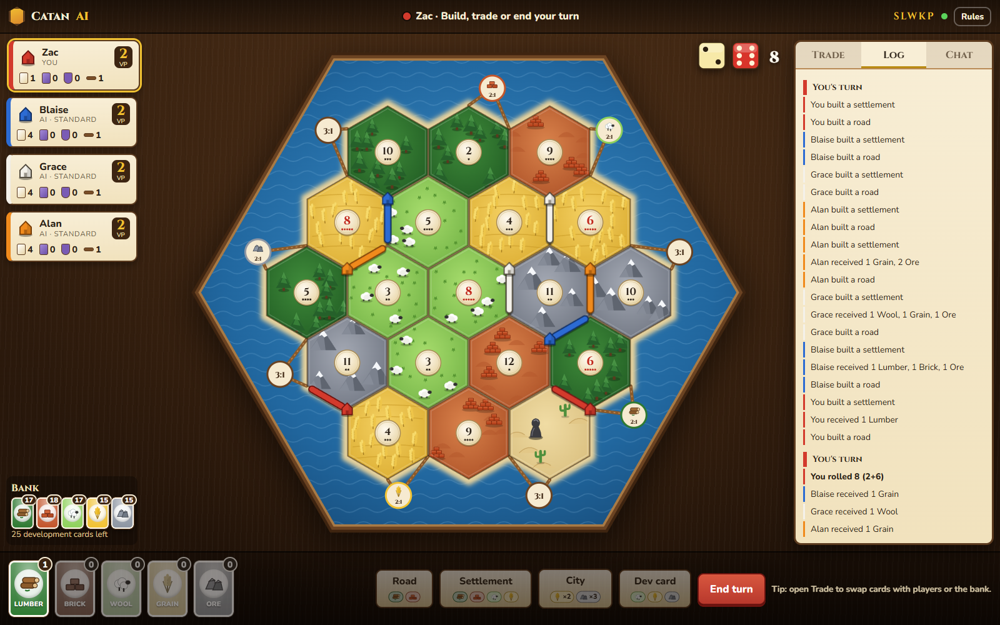
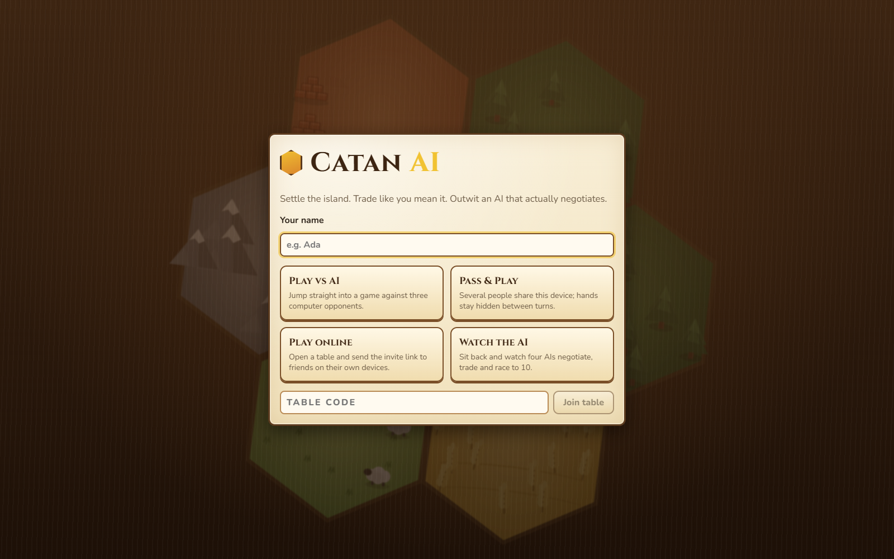
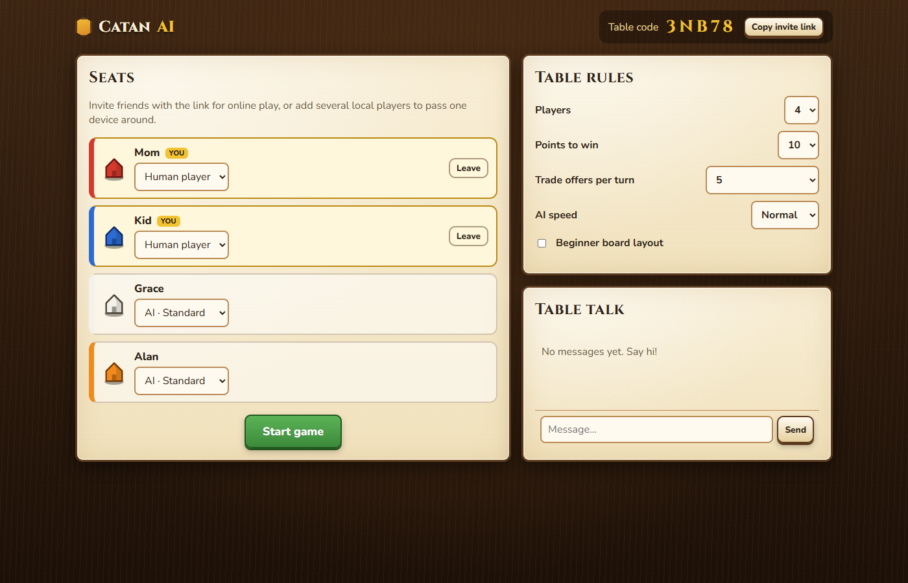
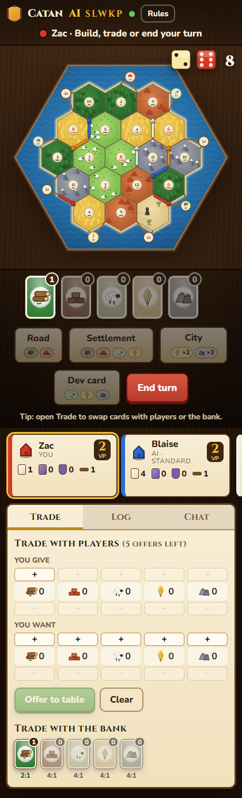

# Catan AI

A Settlers of Catan AI that **actually trades**. Most Catan bots skip player-to-player
negotiation entirely; this one proposes trades, accepts or rejects offers, makes
counter-offers and picks the best partner, all learned through self-play.



* **Rust engine** (`crates/catan-core`): the complete base game for 2-4 players with a
  full trading protocol, ~2-3 million actions per second on one core, fixed action/observation
  encodings for learning, public hand-belief tracking and scripted bots.
* **Python AI** (`python/catan_ai`): an entity-transformer policy with topology-aware
  attention, trained by PPO self-play against a league of past versions, with a parallel
  Rust vectorized environment.
* **Play it** (`web/` + `catan_ai.server`): a polished browser game. Play against the AI,
  pass one device around (pass & play), invite friends to play online from their own
  devices, mix humans and AIs freely, or watch four AIs negotiate.

| Home | Lobby | Mobile |
|---|---|---|
|  |  |  |

## Quick start

Prerequisites: [Rust](https://rustup.rs) (stable), [uv](https://docs.astral.sh/uv/),
Node.js 20+.

```bash
uv sync                                  # builds the Rust engine extension + installs the server
cd web && npm ci && npm run build && cd ..
uv run catan-server                      # open http://localhost:8000
```

Choose **Play vs AI**, **Pass & Play**, **Play online** (share the invite link or the
5-letter table code) or **Watch the AI**. In the lobby the host can switch any seat between
a human and an AI level, and change the table rules.

## Training the AI

Training is designed for a GPU machine (see [docs/TRAINING.md](docs/TRAINING.md)):

```bash
uv sync --extra train                    # add --extra cu130 on Windows + NVIDIA
uv run catan-train --preset smoke        # 2-minute pipeline check
uv run catan-train --preset warmup --run-dir runs/warmup
uv run catan-train --preset full --run-dir runs/main --resume runs/warmup/latest.pt --bot-kind ""
uv run catan-eval neural:runs/main/latest.pt heuristic heuristic heuristic --games 400
cp runs/main/latest.pt models/main.pt    # appears in the lobby as "Neural (main)"
```

## Development

```bash
cargo test -p catan-core --release                       # engine tests
cargo run --release -p catan-core --example bench -- 3000 heuristic
uv run pytest                                            # bindings, training, server
uv run catan-server --reload & (cd web && npm run dev)   # hot reload, http://localhost:5173
```

See [CLAUDE.md](CLAUDE.md) for conventions and gotchas.

## Documentation

| Doc | Contents |
|---|---|
| [docs/ARCHITECTURE.md](docs/ARCHITECTURE.md) | System overview, key decisions, data flow |
| [docs/ENGINE.md](docs/ENGINE.md) | Rules model, phases, trading protocol, action/observation encodings, performance |
| [docs/TRAINING.md](docs/TRAINING.md) | Model, PPO details, training and deployment of models |
| [docs/SERVER.md](docs/SERVER.md) | Server configuration, WebSocket protocol, deployment |
| [docs/WEB.md](docs/WEB.md) | Web client structure |
| [docs/ROADMAP.md](docs/ROADMAP.md) | What's next |
| [docs/PROGRESS.md](docs/PROGRESS.md) | What's done, benchmarks, known limitations |

## Deployment

```bash
docker build -t catan-ai .               # --build-arg WITH_TORCH=1 to serve neural bots
docker run -p 8000:8000 -v catan-data:/data -v $PWD/models:/models catan-ai
```

Put it behind a reverse proxy with TLS and WebSocket support.

---

Catan is a trademark of CATAN GmbH. This is an unofficial fan project for research and
personal play; it is not affiliated with or endorsed by CATAN GmbH.
